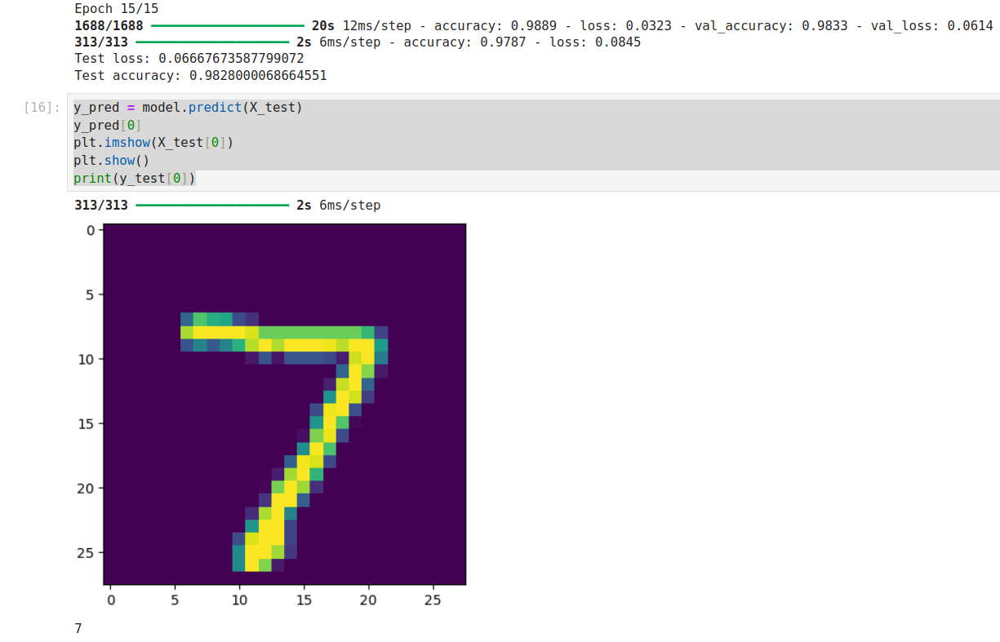

# 🧠 Digit Classifier

A simple neural network that classifies handwritten digits using the MNIST dataset.

## 🚀 Features
- Uses TensorFlow and Keras
- 98.4% accuracy on test data
- Visualizes sample predictions

## 🛠 Requirements
See [requirements.txt](requirements.txt)

## 📊 Output Example

